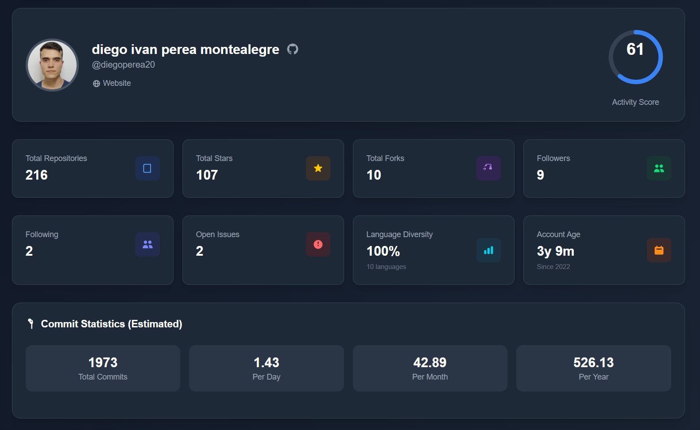
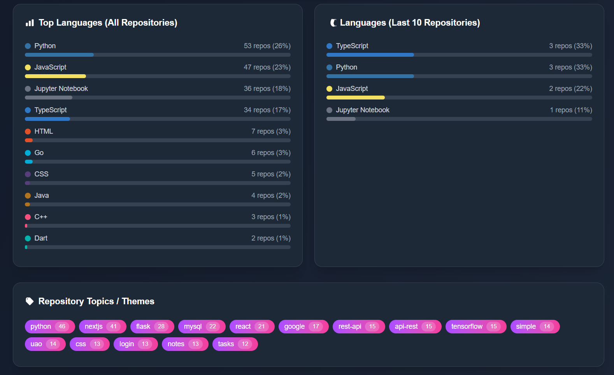

# GitHub Profile Analytics

A comprehensive web application that provides in-depth analytics and insights for any GitHub profile. Built with Next.js, TypeScript, and Tailwind CSS, this tool offers a beautiful and responsive dashboard to analyze GitHub user statistics, repository data, and development patterns.


<p align="center">
  
</p>

<p align="center">
  
</p>


## 🚀 Getting Started

### Prerequisites

- Node.js 18+
- npm or yarn

### Installation

1. Clone the repository:

```bash
git clone <repo_url>
cd <repo_name>
```

2. Install dependencies:

```bash
npm install
# or
yarn install
```

3. Run the development server:

```bash
npm run dev
# or
yarn dev
```

4. Open [http://localhost:3000](http://localhost:3000) in your browser.

## 🛠️ Usage

1. **Enter a GitHub username** in the search field (e.g., `diegoperea20`)
2. **Click "Analyze"** to fetch and display comprehensive profile analytics
3. **Explore the dashboard** with various sections:
   - User profile header with activity score
   - Main statistics grid
   - Commit statistics and trends
   - Language distribution charts
   - Repository topics and highlights
   - Recent activity and performance metrics


## 🎯 Key Components

### Analytics Dashboard

- **User Profile Section**: Displays avatar, name, bio, and social links
- **Statistics Cards**: Visual metrics with icons and colors
- **Language Charts**: Progress bars showing language distribution
- **Repository Cards**: Interactive repository previews
- **Activity Score**: Circular progress indicator

### Data Visualization

- **Language Distribution**: Color-coded progress bars
- **Commit Trends**: Bar charts for yearly commit data
- **Activity Metrics**: Visual score representation
- **Topic Badges**: Gradient-styled topic tags

## 🔧 Technologies Used

- **[Next.js](https://nextjs.org/)** - React framework with App Router
- **[TypeScript](https://www.typescriptlang.org/)** - Type-safe JavaScript
- **[Tailwind CSS](https://tailwindcss.com/)** - Utility-first CSS framework
- **[GitHub API](https://docs.github.com/en/rest)** - Data source for user and repository information

## 📊 API Endpoints

The application uses GitHub's REST API to fetch:

- User profile information
- Repository data and statistics
- Commit history and activity patterns
- Language and topic information


## 🤝 Contributing

Contributions are welcome! Please feel free to submit a Pull Request. For major changes, please open an issue first to discuss what you would like to change.


## 🌟 Features Showcase

### Profile Analysis

- Comprehensive user profile information
- Activity scoring algorithm
- Social media integration

### Repository Insights

- Language distribution analysis
- Topic and theme extraction
- Performance metrics

### Visual Analytics

- Interactive charts and graphs
- Color-coded statistics
- Responsive data visualization

---

**Note**: This application uses the GitHub API and may be subject to rate limiting for anonymous users. For extended use, consider configuring GitHub API tokens.


### 📄 License

This project is licensed under the MIT License - see the [LICENSE](LICENSE) file for details.

---

## 👨‍💻 Author / Autor

**Diego Ivan Perea Montealegre**

- GitHub: [@diegoperea20](https://github.com/diegoperea20)

---

Created by [Diego Ivan Perea Montealegre](https://github.com/diegoperea20)
